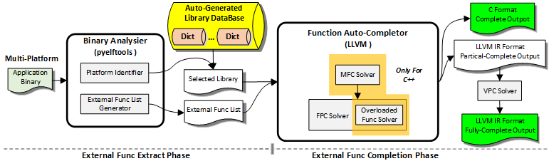

# EFACT: an External Function Auto-Completion Tool to  Strengthen the Static Binary Lifting

EFACT is an External Functions Auto-completion tool. External functions are those functions that are dynamically linked and referenced from header files. (such as libc, libstdc++,libgfortran)

the input of this tool is an elf file, and the output is a llvm IR format and C/C++ program format file which include the completed external functions' definations. 

to use this tool ,you have to make sure the gcc version on your platform is larger than the targeting elf file(we recommend install the latest gcc on your computer).

this tool has been tested to work on x86-64 Ubuntu20.04.

  The image below shows the overall architecture of the tool.




# Dependencies
to use this tool,you have to install :

| Name                                                       | Version |
| ---------------------------------------------------------- | ------- |
| [jsoncpp](https://github.com/open-source-parsers/jsoncpp)                                | Latest  |
| [llvm](https://github.com/llvm/llvm-project)                                | 11.0+   |
| [Clang](http://clang.llvm.org/)                            | 11.0+   |
| [pyelftools](https://github.com/eliben/pyelftools)           | Latest  |


## How to use 
1.put the EFACT.py under the pyelftools dir,the file structure must be the same with the template below.


    |-- EFACT
        |-- DemanglingTools/
            |--jsoncpp/ #clone from github and build
            |--llvm/ #builed llvm library in you computer,you have to copy it from /usr/lib/llvm-11/include/llvm
            |--test.cpp
        |-- LibraryDataBase/
        |-- pyelftools/ #clone source code from github, just pip install
            |--EFACT.py
            |--elftools/
            |--...
        |-- test/
        |-- Result/
        |-- README.md
        |-- generate_glibc_dict.py
        |-- dict_example
        |-- openssl
        |-- llvm_pass_for_VPC
            |--changeBugOffset #a pass to change the bug offset in the llvm ir
            |--printfPass.cpp  #a pass to resolve the printf VPC.
            |--va_list - #a pass to address the va_list VPC between ISAs.
            |--rdtsc - #a pass to address the unsupport of the rdtsc on AArch64.
            |--checkLinkerType #a pass to change the linker type wich AArch64 not support.
            |--ExternalEntryPointRecovery #a pass to address the External Entry Point porblem.
            |--dlopen/symPass.cpp - #Passes to resolve the function loaded by dlopen/sym.


2.set environment 'LIFT_GCC_LIB_PATH' to point to the "LibraryDataBase" dir
 
```bash
$ export LIFT_GCC_LIB_PATH="home/EFACT/LibraryDataBase"
```
3.type command:
```bash
$ python EFACT.py -complement ../test/X86/MotivatingExample 
```
4.the outputfile will generated in the 'Result' directory

**for Fortran source program, we recommand you to add the following path to you CPATH environment:
```bash
CPATH="<path-to-built gcc>/libgfortran/:<path-to-built gcc>/:<path-to-built gcc>/build/x86_64-pc-linux-gnu/libgfortran/:<path-to-built gcc>/libquadmath/:<path-to-built gcc>/libgcc/:<path-to-built gcc>/build/x86_64-pc-linux-gnu/libgcc/:<path-to-built gcc>/libbacktrace/:<path-to-built gcc>/build/libbacktrace/" 
```


## Detailed introduction of other parts
The project also has two sub-components, namely the C++ Demangling sub-module and the dict auto-generation sub-module. The following describes how to use them respectively.

## C++ Demangling sub-module 
this sub-module is written by c++,and based on [jsoncpp](https://github.com/open-source-parsers/jsoncpp) and llvm/Demangle.h. To build the tools, you have to make sure the structure above.

your platform may have some error while lunching the Demanglingtools(elf)，we recommend you to regenerate the Demanglingtools, try:


first clone the jsoncpp, and build it (see the dev.makefile in this projext). Then:
```bash
$ clang++ -g test.cpp -o Demanglingtools ./llvm/lib/libLLVMDemangle.a ./jsoncpp/build/debug/lib/libjsoncpp.a
```

## Dict auto-generation  sub-module 
### clang AST-Dump
This submodule is mainly responsible for parsing an AST tree containing header files of external libraries, and parsing function definitions (such as return values and parameters, etc.) from it. This information can assist the implementation of automation tools.

Now the libc.h and libcxx.h only include some common header files in gcc, not all the header files. the coverage of header files will affect the auto-completion rate. you can include more headers in these files.(also change the definition in EFACT.py)

to regenerate the dict library,try:
```bash
#point to your clang
$ export CLANG_EXE="/usr/lib/llvm-11/bin/clang"
#point to your libclang.so
$ export CLANG_LIB="/usr/lib/llvm-11/lib/libclang-11.so.1"

#change the CPATH to point to the target builted library
$ export CPATH="/home/gcc-9.4.0/include/c++/9.4.0/"

#change the CPLUS_INCLUDE_PATH to point to the target builted library
$ export CPLUS_INCLUDE_PATH="/home/gcc-9.4.0/include/c++/9.4.0/"

$ python generate_glibc_dict.py  
       --type c 
       --input ./dict_example/libc.h 
       --output ./dict_example/allcdict_param.py 
```

            
### Our attempt on calngd (not adopted)

This tool is based on clangd-indexer, which is a part of [clangd](https://clangd.llvm.org/), a language server that provides IDE-like features to editors and other tools. 

To build the tools, we offers an llvm patch, please follow the instructions below:

```bash
$ git clone --depth 1 https://github.com/llvm/llvm-project.git
$ cd llvm-project
$ git apply --check <path-to-0001-feat-clangd-extractor.patch> # check if the patch can be applied
$ git apply <path-to-0001-feat-clangd-extractor.patch>
$ cmake -S llvm -B build -G Ninja -DLLVM_ENABLE_PROJECTS=clang,clang-tools-extra -DCMAKE_BUILD_TYPE=Release
$ ninja -C build
```

After building the tools, you can use the following command to generate the dictionary:

```bash
$ ./build/bin/clangd-extractor --import-full-type-definitions --executor=all-TUs <path-to-compile-commands.json> > ./dict_example/allcdict_clangd.py
```

Compile commands can be generated by CMake, for example:

```bash
$ cmake -S . -B build -DCMAKE_EXPORT_COMPILE_COMMANDS=ON
```